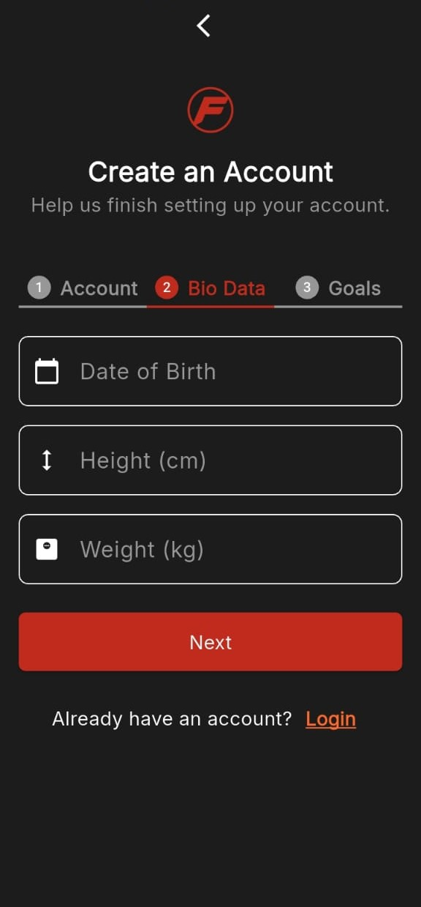

# FitRush

## Description
FitRush is a cross-platform mobile app designed to help users track daily fitness activities, monitor progress, and stay motivated toward their health goals. It integrates seamlessly with health services like **Google Fit** and **Apple Health** to automatically collect activity data such as steps, distance, and workouts. Additionally, users can set and track personal goals.

## Target Users
FitRush is primarily built for **youth**, but is suitable for **all age groups** who want to not only get healthier but also maintain their health over time.

## Key Features
- **Health Tracking** — View today's and the last 7 days' activity stats.
- **Authentication** — Secure sign-in and sign-up using Firebase Auth.
- **Goal Tracking** — Set personal goals and visualize progress.
- **Manual Activity Logging** — Store custom activity data using offline support via Drift DB.

## Tech Stack

### Flutter Dependencies:
```yaml
flutter:
  sdk: flutter

drift: ^2.26.1
drift_flutter: ^0.2.4
path_provider: ^2.1.5
json_annotation: ^4.9.0

equatable: ^2.0.7

dio: ^5.8.0+1

flutter_bloc: ^9.1.1
health: ^12.2.0
permission_handler: ^12.0.0+1
intl: ^0.20.2
fl_chart: ^1.0.0
percent_indicator: ^4.2.5
shared_preferences: ^2.5.3
firebase_core: ^3.13.0
firebase_auth: ^5.5.3
firebase_messaging: ^15.2.5
flutter_local_notifications: ^19.2.0

cupertino_icons: ^1.0.8
```

### Dev Dependencies:
```yaml
flutter_test:
  sdk: flutter

drift_dev: ^2.26.1
build_runner: ^2.4.15
```

## API Integration
Used **Dio** for handling API calls, specifically to calculate and fetch **user BMI**.

## Project Structure
```
lib/
  api/
  cubits/
  database/
  helper/
  models/
  services/
  styles/
  views/
    screens/
  main.dart
  constants.dart
  firebase_options.dart
```

---

## Screenshots

- **Landing Screen** 
    
  _App Landing Screen._

- **Login / Authentication Screen**  
    
  _Firebase-based login screen for secure user authentication._

- **Sign Up 1 / Authentication Screen**  
    
  _Collects basic user information during sign-up._

- **Sign Up 2 / Authentication Screen**  
    
  _Prompts user to enter bio data (e.g., age, height, weight)._

- **Sign Up 3 / Authentication Screen**  
    
  _Collects user’s daily goals including steps, calories, distance, and target weight._

- **Home Screen 1**  
    
  _Displays today’s goal progress, step count, and calories burned progress._

- **Home Screen 2**  
    
  _Displays today’s stat cards and last 7 days' activity chart._

- **Activity Progress Screen (Calories)**  
    
  _Shows calories burned over the past 7 days using charts and daily activity cards._

- **Activity Progress Screen (Steps)**  
    
  _Shows steps walked over the past 7 days using charts and daily activity cards._

- **Profile Screen**  
    
  _Displays user profile information and health goal values._

- **Manual Activity Logging Screen**  
    
  _Allows users to manually add workouts or physical activities._

---


## Getting Started

### Prerequisites:
- Flutter SDK installed
- Firebase project created (Android & iOS)
- Google Fit or Apple Health access setup
- Android/iOS emulator or physical device

### Steps:

1. **Clone the repo**
   ```bash
   git clone https://github.com/M0hamed-Awad/FitRush.git
   cd fitrush
   ```

2. **Install dependencies**
   ```bash
   flutter pub get
   ```

3. **Configure Firebase**
   - Follow [Firebase setup instructions](https://firebase.flutter.dev/docs/overview/)
   - Place `google-services.json` (Android) and `GoogleService-Info.plist` (iOS) in the correct directories
   - Ensure `firebase_options.dart` is generated and correct

4. **Run the app**
   ```bash
   flutter run
   ```


## How to Use

1. Sign up or log in using Firebase Authentication.
2. Grant health and activity permissions when prompted.
3. View your current and weekly fitness stats.
4. Set and monitor your personal health goals.
5. Log any manual activities if automatic data isn't available.


## Future Improvements
- Add validation on user bio data using medically-approved standards.
- Write directly to user health data (currently stored only as history).
- Implement push notifications (setup complete but logic pending).